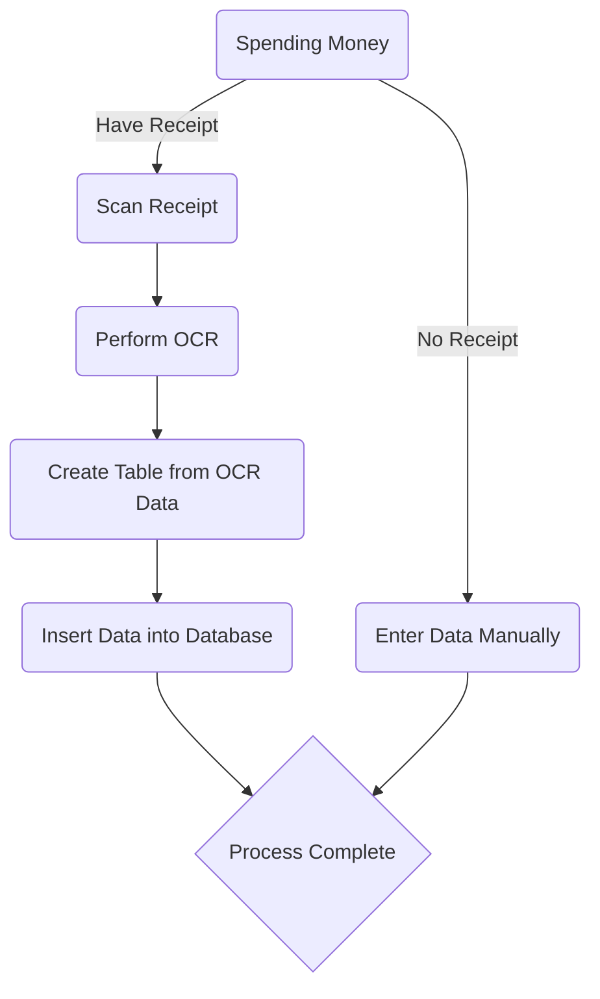

# OCR_recipe_as_Input
## Overview 

basic Idea: `
  if(spending money) {
    if (have recipe) { recipe.scan().ocr().createTable().insertIntoDB } 
    else {enterManually()}

## OCR
I took a photo of my recipe and ran OCR with [https://www.ocrwebservice.com/](https://www.ocrwebservice.com/) selecting output format .XLS. Here is the Output: 

> REWE—Christopher-izab-o-oHG Kreuzstraße 31 04315 LEIPZIG UID Nr.: DE321698348 
> EUR----- VEG POMM APF.ZW. LUPINEN TEMPEH 4,29 B APFEL ROT 1,49 B CASHEWKERNE 2,29 B PARANUSSKERNE 2,59 B WALNUSSKERNE 2,49 B STUDENTENFUTTER 1,69 B SOFT PFLAUMEN 2,99 B BROCCOLI BIO 2,19 B BIO CHIA SAMEN 1,99 B LEINSAMEN 0,99 B LEIMER CROUTONS 1,09 B KICHERERBSE TRIO 1,69 B KIDNEYBOHN. TRIO 1,69 B KICHERERBSEN 0,59 B KIDNEYBOHNEN 0,79 B 
> SUMME EUR 31,34 
> Geg. Mastercard EUR 31,34 * * Kundenbeleg * * Datum: 24.02.2024 Uhrzeit: 11:57:10 Uhr Beleg-Nr. 4784 Trace-Nr. 992027 Bezahlung Contactless DEBIT MASTERCARD Nr. ##M###Wiffil586Q 0000 

## Converting it into a usefull table 
### 1. ChatGPT
I prompted it to present the OCR Data in a Table: 

> | Item                | Price (EUR) | Tax Category |
> |---------------------|-------------|--------------|
> | VEG POMM APF. ZW.   | 2,49        | B            |
> | LUPINEN TEMPEH      | 4,29        | B            |
> | APFEL ROT           | 1,49        | B            |
> | CASHEWKERNE         | 2,29        | B            |
> | PARANUSSKERNE       | 2,59        | B            |
> | WALNUSSKERNE        | 2,49        | B            |
> | STUDENTENFUTTER     | 1,69        | B            |
> | SOFT PFLAUMEN       | 2,99        | B            |
> | BROCCOLI BIO        | 2,19        | B            |
> | BIO CHIA SAMEN      | 1,99        | B            |
> | LEINSAMEN           | 0,99        | B            |
> | LEIMER CROUTONS     | 1,09        | B            |
> | KICHERERBSE TRIO    | 1,69        | B            |
> | KIDNEYBOHN. TRIO    | 1,69        | B            |
> | KICHERERBSEN        | 0,59        | B            |
> | KIDNEYBOHNEN        | 0,79        | B            |

And a Summary of the Recipe Data:

> **Store Name:** REWE Christopher Szabo oHG  
> **Address:** Kreuzstraße 31, 04315 LEIPZIG  
> **UID Number:** DE321698348  
> **Total Amount:** EUR 31,34  
> **Payment Method:** Mastercard (Contactless)  
> **Date of Purchase:** 24.02.2024  
> **Time of Purchase:** 11:57:10 Uhr  
> **Receipt Number:** 4784  
> **Trace Number:** 992027  
> **Debit Card Ending:** 5860  

Possible alternatives: 
  - 2. XLS (Yet to try)

# Manual Input
